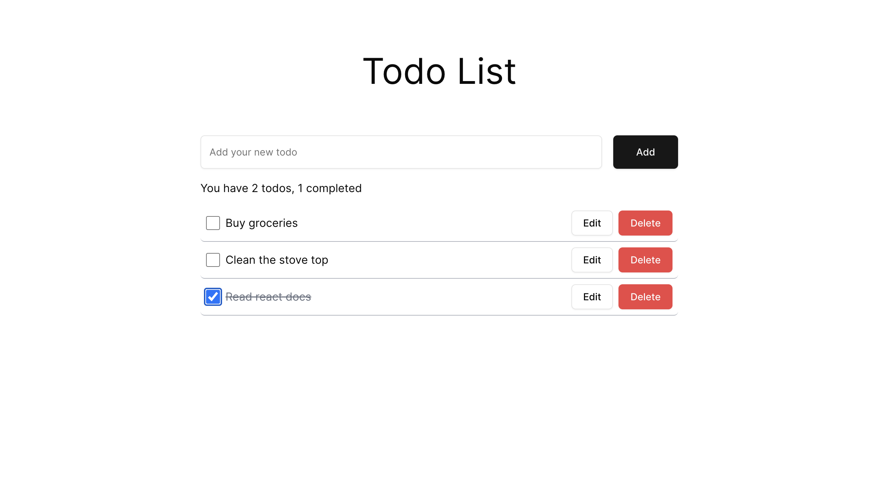
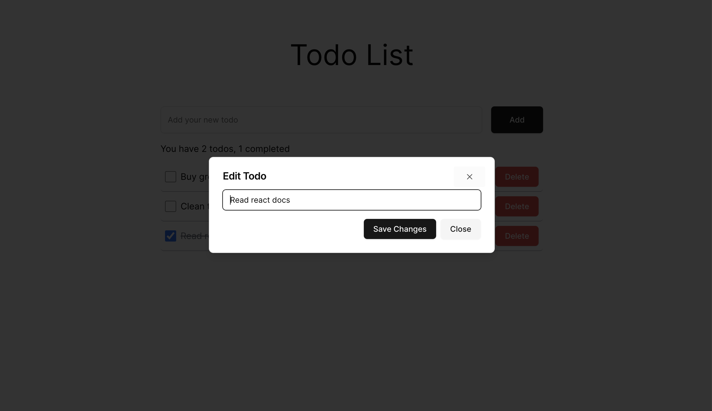

## About The Project
This is a simple Todo list app with the aim to refresh my skills with PostgreSQL, Typescript, creating restful API with Express using MVC, and trying out ShadcnUI.
Data is stored in the local PostgreSQL database.
Features include create, edit, delete and update the status of the todo item.

### Built With

## Screenshot

